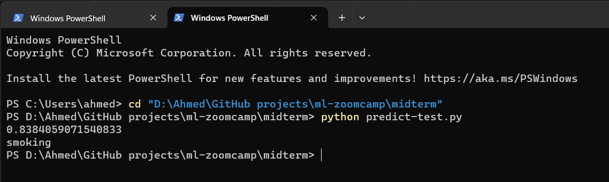
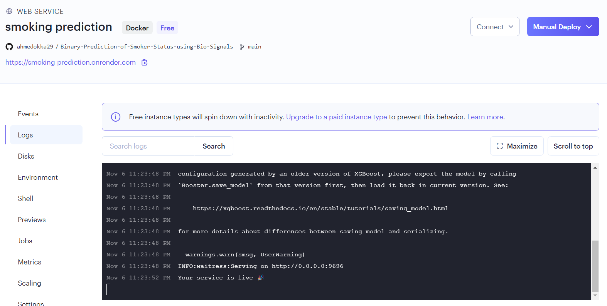
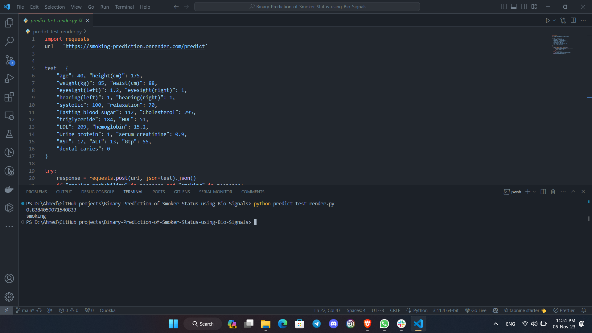

# Midterm project: Binary Prediction of Smoker Status using Bio-Signals

## Problem description

The following dataset was used for this project: <https://www.kaggle.com/competitions/playground-series-s3e24/data>

Merged with the original dataset: <https://www.kaggle.com/datasets/gauravduttakiit/smoker-status-prediction-using-biosignals/data>

A group of scientists are working on predictive models with smoking status as the prediction target. The task is to help them create a machine learning model to identify the smoking status of an individual using bio-signals

Dataset Features:

- `id`: Unique identifier for each data point.
- `age`: Age of the individual, categorized in 5-year intervals.
- `height(cm)`: Height of the individual in centimeters.
- `weight(kg)`: Weight of the individual in kilograms.
- `waist(cm)`: Waist circumference of the individual in centimeters.
- `eyesight(left/right)`: Eyesight measurements for the left and right eyes.
- `hearing(left/right)`: Hearing ability for the left and right ears, represented as binary.
- `systolic`: Systolic blood pressure measurement.
- `relaxation`: Diastolic blood pressure measurement.
- `fasting blood sugar`: Fasting blood sugar level.
- `Cholesterol`: Total cholesterol level.
- `triglyceride`: Triglyceride level.
- `HDL`: High-density lipoprotein cholesterol level.
- `LDL`: Low-density lipoprotein cholesterol level.
- `hemoglobin`: Hemoglobin level in the blood.
- `Urine protein`: Level of protein in urine, categorized.
- `serum creatinine`: Serum creatinine level.
- `AST`: Level of aspartate aminotransferase enzyme.
- `ALT`: Level of alanine aminotransferase enzyme.
- `Gtp`: Level of gamma-glutamyl transferase enzyme.
- `dental caries`: Presence (1) or absence (0) of dental cavities.
- `smoking`: Target variable indicating if the individual is a smoker (1) or not (0).
  
**All the datasets used in the project are provided and accessible within the repository.**

## EDA

We conducted an Exploratory Data Analysis (EDA) to gain insights into our dataset. Here's a description of the EDA performed and some of the key findings:

- **Ranges of Values**: We analyzed the ranges of values for both discrete and continuous features. This allowed us to understand the data distribution and identify potential outliers.

    ```python
    df[num_var].describe().T
    ```

- **Missing Values**: We investigated and handled missing values. Here's a summary of missing values for each feature in the dataset:

    ```python
    def summary(df):
        sum = pd.DataFrame(df.dtypes, columns=['dtypes'])
        sum['missing #'] = df.isna().sum()
        sum['missing %'] = (df.isna().sum()) / len(df)
        sum['uniques'] = df.nunique().values
        sum['count'] = df.count().values
        return sum

    summary(df)
    ```

- **Analysis of Target Variable**: We provided an analysis of the target variable 'smoking' using a count plot.

    ```python
    sns.countplot(data=df, x='smoking')
    ```

- **Feature Importance Analysis**: To identify important features, we conducted a Kernel Density Estimate (KDE) analysis for selected variables comparing smokers and non-smokers.

    ```python
    selected_var = ['age', 'relaxation', 'systolic', 'hemoglobin', 'Gtp', 'ALT', 'AST', 'LDL', 'HDL', 'Cholesterol', 'eyesight(right)', 'eyesight(left)']
    for var in selected_var:
        sns.kdeplot(data=df, x=var, hue='smoking')
    ```

- **Correlation Matrix**: We created a correlation matrix to analyze the relationships between numerical variables.

    ```python
    corr_matrix = df[num_var].corr()
    mask = np.triu(np.ones_like(corr_matrix, dtype=bool))

    plt.figure(figsize=(15, 12))
    sns.heatmap(corr_matrix, mask=mask, annot=True, cmap='Blues', fmt='.2f', linewidths=2)
    plt.title('Correlation Matrix', fontsize=15)
    ```

Some observations:

- Since the correlation values between any two variables is not greater than 90%, none of the attributes were removed.

## Model Training and Parameter Tuning

In this section, we describe the model training and parameter tuning process for our machine learning project. We tested several models and tuned their hyperparameters to optimize their performance. Here's an overview of the process and results:

### Logistic Regression

We started with Logistic Regression, and the initial results showed a model accuracy of 0.7408 and an ROC score of 0.8279. However, we found that changing the C value (the regularization parameter) didn't improve the model's performance, and the default value worked best.

### Random Forest

The initial untuned Random Forest model achieved an accuracy of 0.7767 and an ROC score of 0.8605. After hyperparameter tuning, the model's performance improved slightly, with an accuracy of 0.7722 and an ROC score of 0.8545.

### XGBoost

The initial XGBoost model had an accuracy of 0.7767 and an ROC score of 0.7781. However, after parameter tuning, the model's accuracy increased to 0.779, with an ROC score of 0.863.

Here's an overview of the process:

- We used k-fold cross-validation to assess model performance, and the average ROC AUC score was used as a metric.
- For Logistic Regression, we experimented with different C values, but the default value performed the best.
- Random Forest hyperparameters tuned included the number of estimators and maximum depth.
- XGBoost hyperparameters were optimized using a grid search for 'max_depth' parameter.
- We trained and evaluated the models on the validation dataset.

We selected the best-tuned models for our final solution, which is XGBoost.

## Exporting notebook to script

The logic for training the best model is exported to a separate script named `train.py`.

## Dependencies and Virtual Environment

To set up your machine learning project, we've provided a Pipfile specifying the necessary dependencies and used Pipenv to create a virtual environment. Follow these steps to install the dependencies and activate the virtual environment:

### Step 1: Install Dependencies

1. Ensure you have Python 3.11 installed on your system.

2. Open a terminal and navigate to your project directory.

3. Create a virtual environment and install project dependencies using Pipenv:

   ```bash
   pipenv install
   ```

This command will create a virtual environment and install the required packages from the Pipfile.

### Step 2: Activate the Virtual Environment

1. Once the dependencies are installed, activate the virtual environment with this command:

   ```bash
   pipenv shell
   ```

    You will see the command prompt change to indicate that the environment is active.

    Now, your virtual environment is set up and activated. You can run your Flask application using Waitress with the following command:

    ```bash
    waitress-serve --listen=0.0.0.0:9696 predict:app
    ```

Your Flask application will be accessible at `http://localhost:9696`.

Please ensure that you run this command within the activated virtual environment to use the correct dependencies.

## Containerization

Our machine learning application has been containerized for easy deployment using Docker. To build and run the container, follow these steps:

### Step 1: Building the Container

1. Make sure you have Docker installed on your system.

2. Navigate to the directory containing your Dockerfile.

3. Use the following command to build the container. Replace `[containerName]` with your preferred container name (e.g., "ml-app"):

   ```bash
   docker build -t [containerName] .
   ```

    This command instructs Docker to build an image using the Dockerfile in the current directory.

### Step 2: Running the Container

1. Once the container is built, you can run it using the following command:

    ```bash
    docker run -it --rm -p 9696:9696 [containerName]
    ```

   - -it enables an interactive terminal.
   - --rm removes the container when it exits.
   - -p 9696:9696 maps port 9696 on your host to port 9696 within the container.
   - [containerName] is the name you provided when building the container.

2. Then, you can run the project with the following command:

    ```bash
    python predict-test.py
    ```

Your machine learning application is now running within the Docker container, and you can access it at `http://localhost:9696`.

### Dockerfile

Here is the content of the Dockerfile used to create the container:

```docker
FROM python:3.11-slim

RUN pip install pipenv

WORKDIR /app

COPY ["Pipfile","Pipfile.lock","./"]

RUN pipenv install --system --deploy

COPY ["predict.py" , "model_xgboost.bin" , "./"]

EXPOSE 9696

ENTRYPOINT [ "waitress-serve","--listen=0.0.0.0:9696","predict:app" ]
```

This Dockerfile sets up a Python environment, installs dependencies, and exposes port 9696 to run your Flask application using Waitress. The `ENTRYPOINT` specifies how to start the application.

## Sample output

Locally, user shoud be able to get a similar output to the one shown below upon running all steps successfully.



Sample data used in predict-test.py

```python
test = {
    "age": 40, "height(cm)": 175,
    "weight(kg)": 85, "waist(cm)": 88,
    "eyesight(left)": 1.2, "eyesight(right)": 1,
    "hearing(left)": 1, "hearing(right)": 1,
    "systolic": 100, "relaxation": 70,
    "fasting blood sugar": 112, "Cholesterol": 295,
    "triglyceride": 184, "HDL": 51,
    "LDL": 209, "hemoglobin": 15.2,
    "Urine protein": 1, "serum creatinine": 0.9,
    "AST": 17, "ALT": 13, "Gtp": 55,
    "dental caries": 0
}
```

## Cloud Deployment

1. We've integrated Render with our repository, enabling automatic builds and deployments. This ensures that your machine learning application is always up to date.

   

2. With Render, your application is accessible online through a provided URL. This makes it easy for users to interact with your machine learning solution without any complicated setup.

3. You can test your deployed application using the provided URL `https://smoking-prediction.onrender.com/predict`, ensuring that it functions as expected in an online environment.
4. To test it just run `predict-test-render.py`

   
